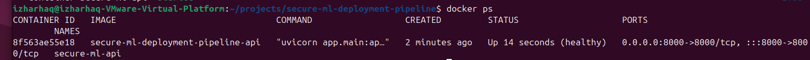
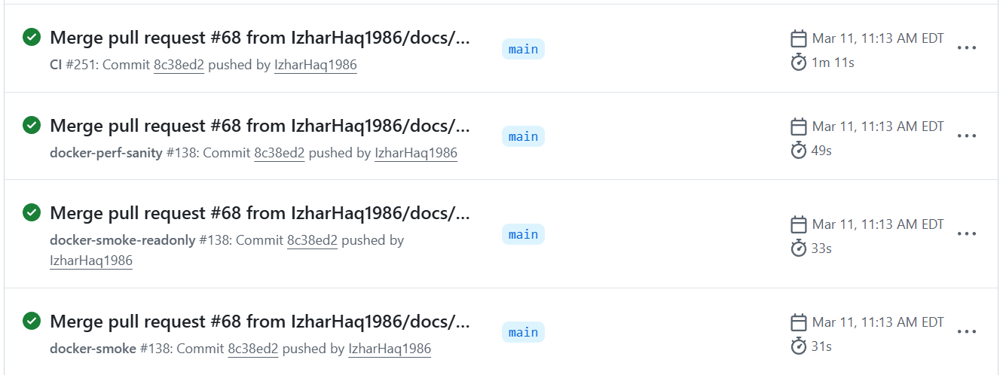
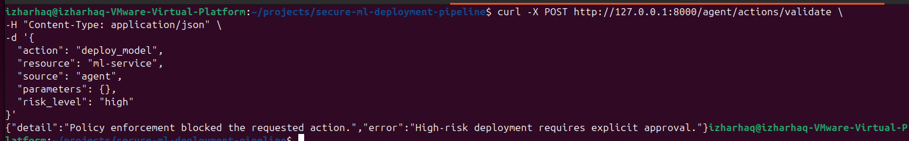
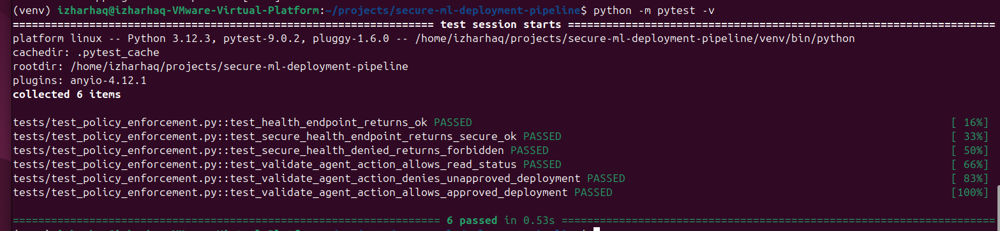

# Secure ML Deployment Pipeline


      

---

## Project Description

This repository demonstrates a secure, end-to-end machine learning deployment pipeline.

It showcases:

- containerized ML service deployment
- supply-chain security through SBOM generation, image signing, and verification
- policy-based agent security enforcement
- CI/CD-driven validation and deployment checks

The project is designed as a portfolio-quality example for secure ML systems, DevOps engineering workflows, and security-focused deployment practices.

---

## Features

- FastAPI-based inference service
- Dockerized deployment with runtime hardening
- Docker Compose-based deployment validation
- Trivy vulnerability scanning
- SBOM generation with Syft
- Cosign image signing and verification
- Policy-based agent action enforcement
- High-risk deployment gating
- Audit logging for policy decisions
- Automated test coverage with pytest
- CI pipeline with GitHub Actions

---

## Project Structure

```text
secure-ml-deployment-pipeline/
├── app/
│   ├── main.py
│   └── security/
│       ├── exceptions.py
│       ├── models.py
│       └── policy_engine.py
├── docs/
│   ├── screenshots/
│   │   ├── ci-pipeline-success.png
│   │   ├── container-running.png
│   │   ├── policy-denied-log.png
│   │   └── tests-passed.png
│   └── security/
│       └── agent-security-model.md
├── tests/
│   └── test_policy_enforcement.py
├── .github/
│   └── workflows/
│       └── ci.yml
├── docker-compose.yml
├── requirements.txt
├── requirements-dev.txt
├── project_state.md
└── README.md
```

---

## Getting Started

### Prerequisites
- Python 3.12+
- Docker
- Git

---

## Setup

```bash
git clone https://github.com/IzharHaq1986/secure-ml-deployment-pipeline.git
cd secure-ml-deployment-pipeline
python -m venv venv
source venv/bin/activate
pip install -r requirements.txt
```

---

## Run Application

```bash
uvicorn app.main:app --reload
```

---

## Run Tests
```bash
python -m pytest -v
```

---

## API Endpoints

### Health Check
```text
GET /health

### Protected Health Check

POST /agent/actions/validate

### Example request:

{
  "action": "read_status",
  "resource": "service-health",
  "source": "agent",
  "parameters": {},
  "risk_level": "low"
}
```

---

## Verifiable Deployment Path

This repository demonstrates a security-focused ML deployment path:

- model service build
- container smoke validation
- vulnerability scanning
- SBOM generation
- container image signing
- signature verification
- deployment validation

---

## Architecture Diagram

```mermaid
flowchart TD
    A[Developer Pushes Code] --> B[GitHub Actions CI]
    B --> C[Run Tests and Validation]
    C --> D[Build Container Image]
    D --> E[Trivy Security Scan]
    E --> F[Generate SBOM with Syft]
    F --> G[Sign Image with Cosign OIDC]
    G --> H[Verify Signature]
    H --> I[Docker Compose Deployment]
    I --> J[Health and Readiness Validation]

    J --> K[FastAPI Service]
    K --> L[Strict Settings Validation]
    K --> M[Policy Engine]
    M --> N[Allow or Deny Agent Action]
    N --> O[Audit Log Decision]

---

## Verify the Supply Chain

### 1. Pull the Image

```bash
docker pull ghcr.io/izharhaq1986/secure-ml-deployment-pipeline:latest
```

### 2. Verify Image Signature (Cosign OIDC)

```bash
cosign verify \
  --certificate-identity "https://github.com/IzharHaq1986/secure-ml-deployment-pipeline/.github/workflows/cosign-sign.yml@refs/heads/main" \
  --certificate-oidc-issuer "https://token.actions.githubusercontent.com" \
  ghcr.io/izharhaq1986/secure-ml-deployment-pipeline:latest
```

### 3. Inspect SBOM (SPDX)

```bash
gh run download -n sbom --repo IzharHaq1986/secure-ml-deployment-pipeline
cat *.spdx.json | jq '.packages[0:5]'
```

### 4. Run the Service Locally

```bash
docker run -p 8000:8000 \
  -e MODEL_NAME=fraud-detection-model \
  ghcr.io/izharhaq1986/secure-ml-deployment-pipeline:latest
```

Test:

```bash
curl http://127.0.0.1:8000/health
``` 

---

## What This Proves

- The container image is signed and verifiable using GitHub OIDC identity  
- The build pipeline produces a traceable SBOM for dependency inspection  
- The deployment can be reproduced with consistent runtime behavior  
- Security checks are enforced automatically before code reaches production  

---

## Security Artifacts

The pipeline produces and validates these controls:

- container runtime validation through GitHub Actions
- Trivy-based vulnerability scanning
- SPDX SBOM generation
- Cosign keyless signing
- Cosign verification against the published GHCR image

---

## Environment-Based Deployment

The deployment layer supports environment-based configuration through Docker Compose.

### Create a Local Environment File

Copy the example file:

```bash
cp .env.example .env
```

---

## Kubernetes Deployment (Baseline)

A minimal Kubernetes deployment is included under `k8s/`.

### Files

- `k8s/deployment.yaml` → application deployment with probes and security context 
- `k8s/service.yaml` → internal ClusterIP service 

### Validate Manifests (offline)

```bash
kubeconform -strict -summary k8s/deployment.yaml k8s/service.yaml
```

## Agent Security Enforcement

The project includes a lightweight policy enforcement layer for untrusted agent-triggered actions.

### Security Controls Implemented

- centralized policy engine for action enforcement
- default-deny behavior for unregistered actions
- validated external input boundary for agent-submitted requests
- explicit separation between external request models and internal enforcement models
- controlled HTTP 403 responses for policy violations
- audit logging for policy approvals and denials
- high-risk deployment gating with explicit approval checks

---

## Enforcement Flow

Agent request -> validated API input -> internal action model -> policy engine -> allow/deny decision

---

## Example Protected Actions
read_status
- low-risk read action
- allowed only from approved sources

deploy_model
- high-risk deployment action
- requires:
     - source="agent"
     - risk_level="high"
     - parameters.approved=true

---

## Auditability

Policy decisions are logged at runtime.

Examples:

- approved actions are logged at INFO
- denied actions are logged at WARNING

This provides a minimal audit trail for policy outcomes during local runs, testing, and future deployment integration. 

---

## Test Coverage

Policy enforcement behavior is covered by automated tests, including:

- public health endpoint
- protected health endpoint
- denied policy path
- validated low-risk action approval
- denied unapproved deployment
- approved high-risk deployment

---

## Verify the Published Image

Example verification flow:

```bash
IMAGE_URI=ghcr.io/<owner>/<repo>@sha256:<digest>

cosign verify \
  --certificate-identity "https://github.com/<owner>/<repo>/.github/workflows/cosign-sign.yml@refs/heads/main" \
  --certificate-oidc-issuer "https://token.actions.githubusercontent.com" \
  "$IMAGE_URI"
```
---

## Screenshots

### 1. Container Deployment


### 2. CI Pipeline Execution


### 3. Policy Enforcement (Denied Action)


### 4. Test Execution Results


---

## About This Project

This repository demonstrates:

- secure ML deployment workflows
- DevOps automation and CI/CD integration
- policy-based security enforcement for AI agents
- production-grade repository structure and practices

It is designed for use in:

- GitHub portfolio
- Upwork and freelancing profiles
- technical interviews

---

## Skills Demonstrated
- FastAPI backend development
- Docker containerization and runtime hardening
- CI/CD pipeline design with GitHub Actions
- supply-chain security through SBOM generation, signing, and verification
- policy-based system design
- API validation and boundary enforcement
- automated testing with pytest
- professional repository structuring
