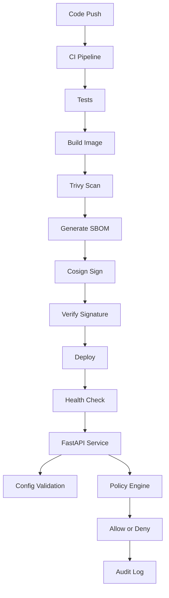

```mermaid
flowchart TD
    A[Code Push] --> B[CI Pipeline]
    B --> C[Tests]
    C --> D[Build Image]
    D --> E[Trivy Scan]
    E --> F[Generate SBOM]
    F --> G[Cosign Sign]
    G --> H[Verify Signature]
    H --> I[Deploy]
    I --> J[Health Check]

    J --> K[FastAPI Service]
    K --> L[Config Validation]
    K --> M[Policy Engine]
    M --> N[Allow or Deny]
    N --> O[Audit Log]
```
